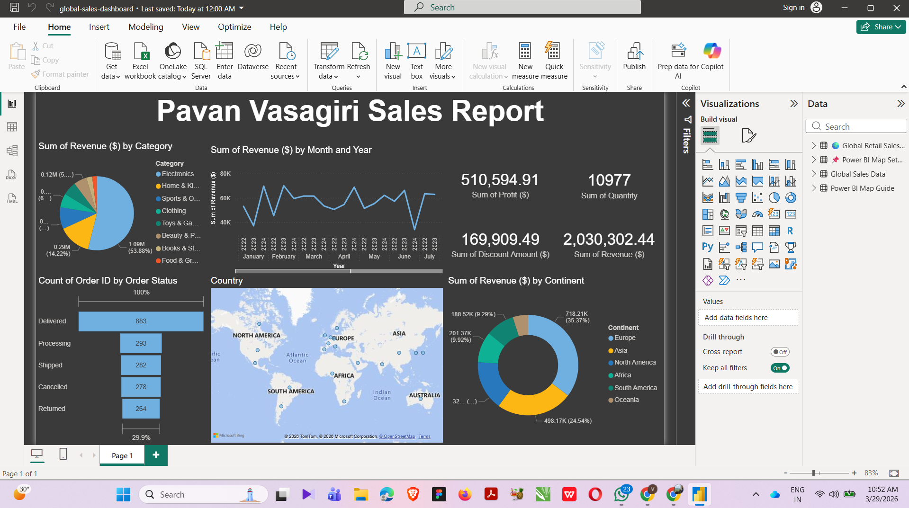

# 🌍 Global Retail Sales Dashboard — Power BI

An interactive Power BI dashboard analyzing 2000+ global sales records across 20 countries and 6 continents.

---

## 📌 Features
- 🌎 World Map with revenue bubbles by city  
- 🗺️ Filled Map showing revenue by country  
- 📊 KPI Cards — Revenue, Profit, Orders, Rating  
- 📉 Charts — Funnel, Pie, Line, Bar, Treemap  
- 🎛️ Slicers — Year, Continent, Category, Segment  
- 🧠 DAX Measures — Profit Margin %, Avg Rating  

---

## 🛠️ Tools Used
- Power BI Desktop  
- DAX  
- Excel  

---

## 📸 Dashboard Preview

---

## 📁 Dataset
- 2000+ records  
- 20 countries  
- 6 continents  

---

## ⚠️ Note
GitHub cannot display `.pbix` files. Download and open in Power BI Desktop.

---

⭐ If you like this project, give it a star!
